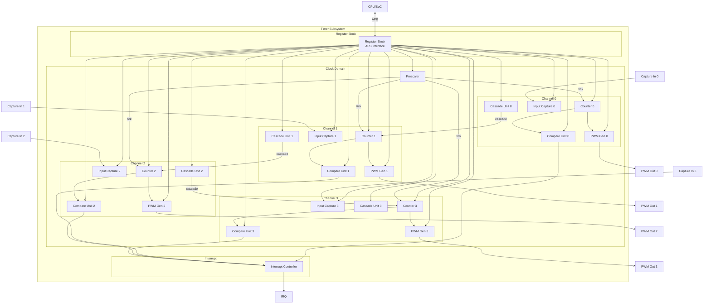
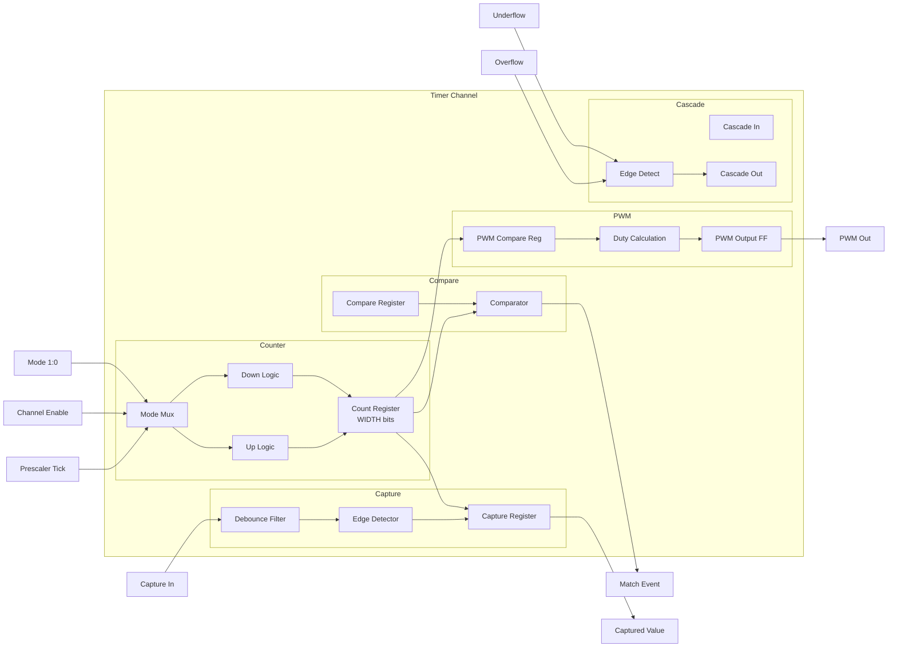
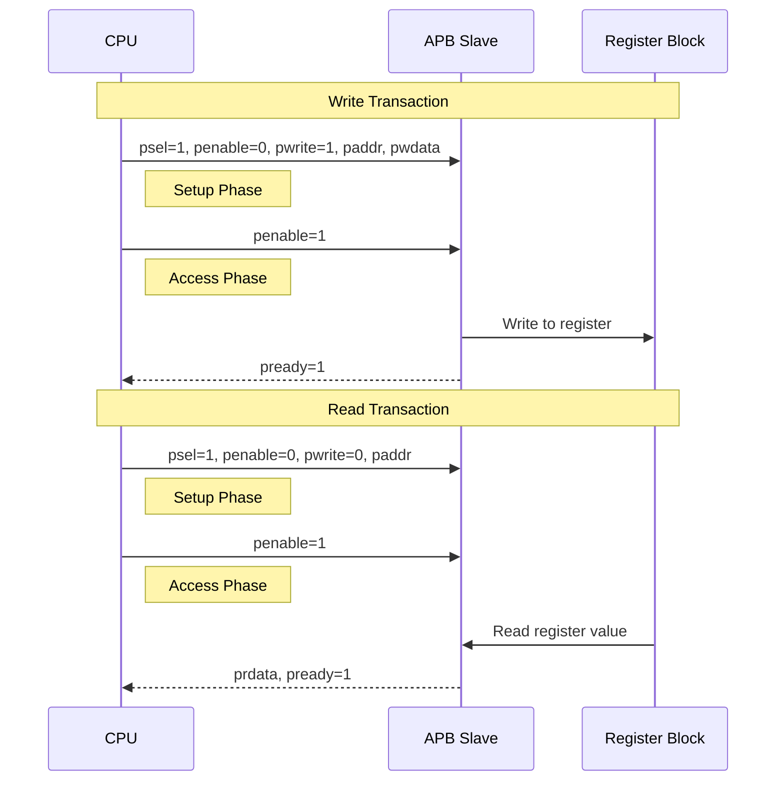
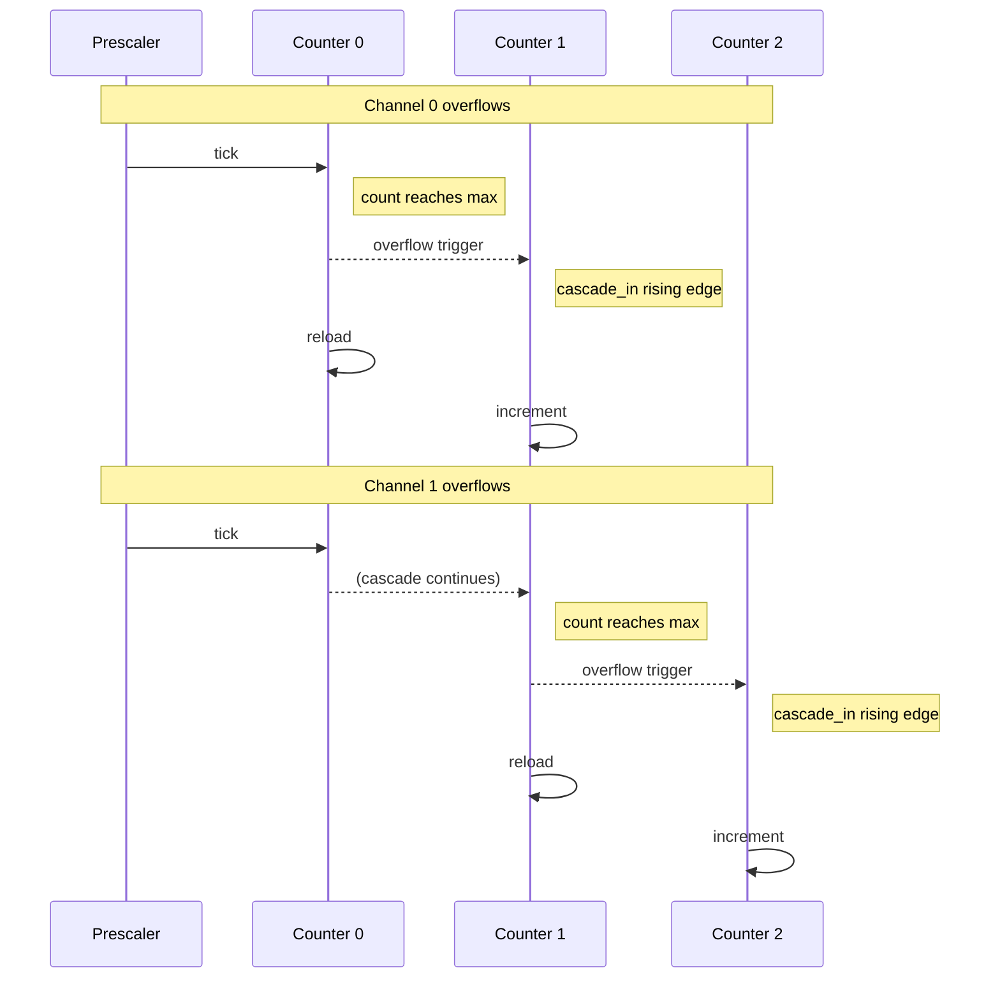
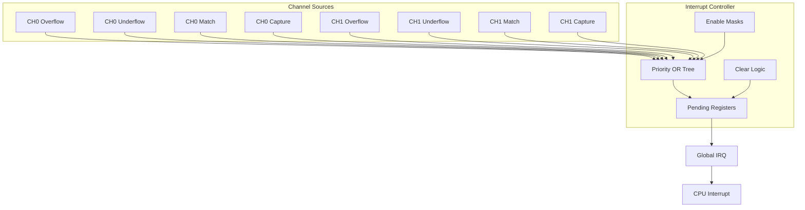
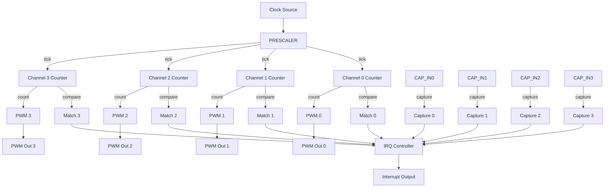
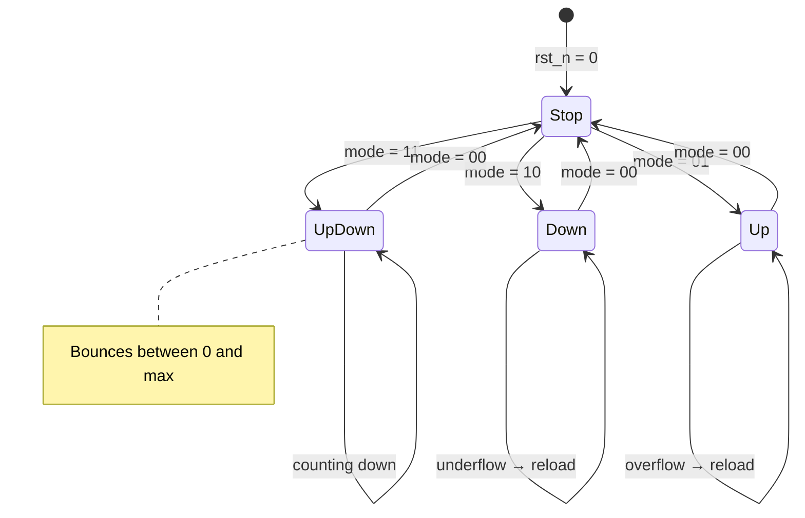
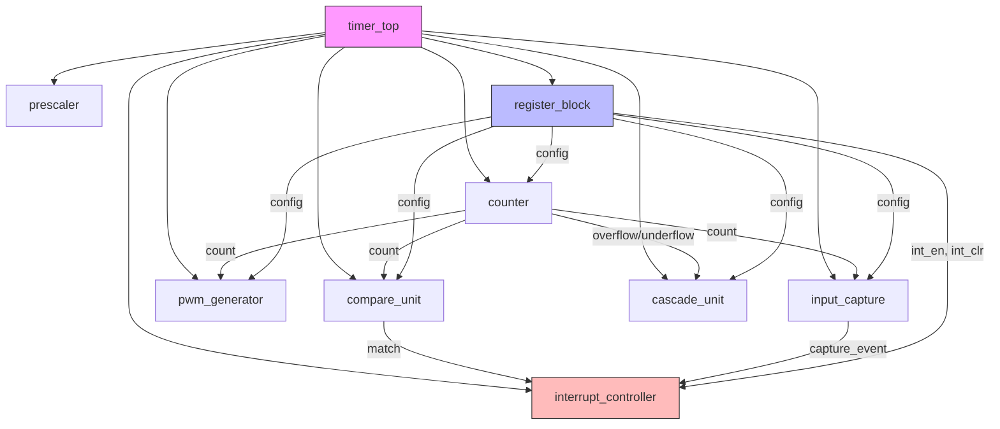

# Architecture - Multi-Channel Timer/Counter Subsystem

## 1. System Overview

## 2. Channel Architecture

Each timer channel follows this internal structure:

## 3. APB Bus Protocol

## 4. Cascade Flow

## 5. Interrupt Flow

## 6. Data Flow Diagram

## 7. State Diagram (Counter Modes)

## 8. Module Dependency Graph

## 9. Timing Diagrams

### 9.1 Up-Count with Overflow

```mermaid
gantt
    title Up-Count Timer with Overflow
    dateFormat X
    axisFormat %s
    
    section Clock
    clk : 0, 1
    clk : 1, 2
    clk : 2, 3
    clk : 3, 4
    clk : 4, 5
    
    section Counter
    count=0 : 0, 1
    count=1 : 1, 2
    count=2 : 2, 3
    count=max : 3, 4
    count=reload : 4, 5
```

### 9.2 PWM Output

```mermaid
gantt
    title PWM 50% Duty Cycle
    dateFormat X
    axisFormat %s
    
    section Counter
    counting up : 0, 5
    
    section PWM Output
    HIGH : 0, 3
    LOW : 3, 5
```

